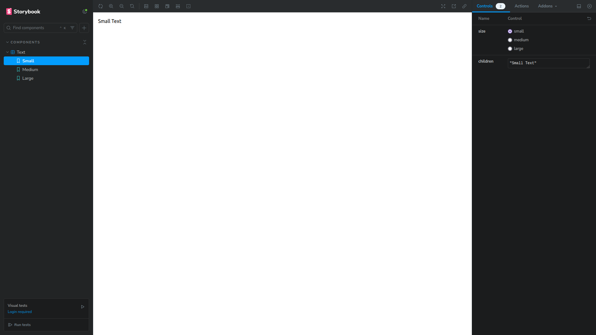

<h2 align='center'>:earth_americas: Next 15 Template :earth_americas:</h2>

<p align="center">


</p>

<p align="center">
  <br>
  
  <br>
  <br>
</p>

## :pushpin: Requirements: :pushpin:

NodeJs: :link: https://nodejs.org/en/

---

#### :arrow_forward: Get Started:

1. Clone this repo

```sh
git clone https://github.com/Aleydon/Next15.git
```

2. Install NPM packages

```sh
npm install
```

3.  Run this project

```sh
npm run dev
```

4. Run conventional commits

```sh
npm run commit
```

---

<h2>Template configuration:</h2>

- Jest + Testing Library for automated testing. :link: https://jestjs.io/ + https://testing-library.com/
- Storybook for component documentation. :link: https://storybook.js.org/
- Eslint + Prettier for code standardization and formatting. :link: https://eslint.org/ + https://prettier.io/
- Typescript for typing. :link: https://www.typescriptlang.org/
- Tailwind Css for styling components. :link: https://tailwindcss.com/
- HuskyJs for automatically lint your commit messages, code, and run tests upon committing or pushing. :link: https://typicode.github.io/husky/
- Commitlint for linting commit messages. :link: https://commitlint.js.org/
- Commitizen for enforcing standardized commit conventions. :link: https://commitizen-tools.github.io/commitizen/

---

<h2>Tests + Storybook:</h2>

- How to run tests:

```sh
npm run test or npm run test:watch
```

It has an example of tests with Jest + Testing-Library in _src/app/page.spec.tsx_

```ts
import { render, screen } from '@testing-library/react';

import Page from './page';

describe('Page Component', () => {
  it('should get the text hello world', () => {
    render(<Page />);
    const hello = screen.getByText('Hello World');
    expect(hello).toBeDefined();
  });

  it('should get the text hello world in the component s heading', () => {
    render(<Page />);
    const heading = screen.getByRole('heading', {
      name: 'Hello World'
    });
    expect(heading).toBeInTheDocument();
  });

  it('must get the link from the page component', () => {
    render(<Page />);
    const link = screen.getByRole('link', { name: 'github.com/Aleydon' });
    expect(link).toBeDefined();
    expect(link).toHaveAttribute('target', '_blank');
    expect(link).toHaveAttribute('aria-label', 'github.com/Aleydon');
  });
});

```

---

- How to run storybook:

```sh
npm run storybook or yarn storybook
```

<p align="center">
  <br>
  
  <br>
  <br>
</p>

also has an example of using Storybook in the Text component in _src/app/components/Text/text.stories.tsx_

```ts
import type { Meta, StoryObj } from '@storybook/react';

import Text, { type TextProps } from '.';

const text: Meta<typeof Text> = {
  component: Text,
  title: 'Components/Text'
};

export default text;

export const Small: StoryObj<TextProps> = {
  args: {
    size: 'small',
    children: 'Small Text'
  }
};

export const Medium: StoryObj<TextProps> = {
  args: {
    size: 'medium',
    children: 'Medium Text'
  }
};
export const Large: StoryObj<TextProps> = {
  args: {
    size: 'large',
    children: 'Large Text'
  }
};
```
